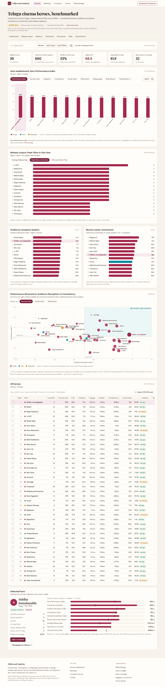

# Tollywood Analysis

A private, dashboard-first benchmarking app for Telugu-cinema **heroes**: named leaderboards, release-cadence and audience charts, a labelled performance scatter, a sortable table, side-by-side comparison, and a separate **Annexure** with film-level evidence, methodology, sources, coverage, change log and a correction workflow.



> **Demo mode is on by default.** Hero names are real, but every film, rating, outcome and reach value is **synthetic** and marked `DEMO DATA` / `FICTIONAL`. Nothing in demo mode is a factual claim.

---

## 1. See it running (no setup)

The quickest path, and it works from a phone:

1. Go to **[vercel.com/new](https://vercel.com/new)** and import this GitHub repository.
2. Keep all defaults and press **Deploy**. No environment variables are needed for demo mode.
3. Open the URL Vercel gives you.

To run locally instead (Node 20.9+):

```bash
npm install
npm run dev          # http://localhost:3000
```

## 2. What is in the app

| Page | What it shows |
|---|---|
| `/` Heroes | Filters (search, All time / Last 5 years / Last 10 films, **Include emerging heroes**), KPI cards, **named leaderboard** (9 metrics), release-output bars, audience and momentum leaders, labelled Audience-vs-Consistency scatter, sortable table with CSV export, selected-hero summary |
| `/rankings` | Full ranked list for any metric plus top 5 for every metric |
| `/compare` | 2–4 heroes side by side (from the table checkboxes or `?heroes=a,b`) |
| `/trends` | Releases per year by type, average outcomes by year, one hero's trajectory |
| `/methodology` | Every formula, weight and threshold, plus what is deliberately excluded |
| `/annexure/…` | 1 Methodology · 2 Hero Registry · 3–4 Hero detail & filmography · 5 Source Ledger · 6 Data Coverage · 7 Change Log · 8 Suggest a Correction |
| `/admin` | Editorial admin (sign-in with `ADMIN_TOKEN`): corrections queue, recalculation, data console, provider status |

Film titles and per-film evidence live only in the Annexure, never on the landing dashboard.

## 3. Go live with real data (Supabase)

1. **Create a Supabase project** at [supabase.com](https://supabase.com). Copy **Project Settings → Database → Connection string → URI**. On Vercel, use the *Transaction pooler* URI (port 6543).
2. **Set environment variables** (Vercel → Project → Settings → Environment Variables, or `.env.local` locally). See [`.env.example`](.env.example):
   - `DATABASE_URL` = your connection string
   - `ADMIN_TOKEN` = a long random string (`node -e "console.log(require('crypto').randomBytes(32).toString('hex'))"`)
   - `NEXT_PUBLIC_DATA_MODE` = `live` (keep `demo` until you have data)
3. **Create tables and seed the roster.** From any machine with Node, or from Claude Code:
   ```bash
   DATABASE_URL="postgres://…" npm run db:migrate
   DATABASE_URL="postgres://…" npm run db:seed          # sources, methodology, curated roster (no films)
   # or, to test live mode end-to-end with fictional films first:
   DATABASE_URL="postgres://…" npm run db:seed:demo     # later: npm run db:seed -- --purge-demo
   ```
4. **Turn on row-level security:** paste [`db/supabase/rls.sql`](db/supabase/rls.sql) into the Supabase SQL editor and run it. Public keys can then read only approved/public rows, and correction submissions stay private.
5. **Redeploy.** Sign in at `/admin`, add verified credits and evidence in the **Data console** (JSON or CSV), then press **Recalculate**.

Live mode shows the latest calculation timestamp, methodology version and confidence. It hides heroes whose evidence is insufficient.

## 4. Adding data (admin)

All writes are validated with Zod, audited in `change_log`, and need `DATABASE_URL`. Browser use: `/admin/data`. Scripts can call the same routes with `Authorization: Bearer $ADMIN_TOKEN`.

| Route | Purpose |
|---|---|
| `POST /api/admin/people` | Create/update a person |
| `POST /api/admin/films` | Create/update a film and its Telugu release (original or dub, theatrical or OTT) |
| `POST /api/admin/credits` | Approve a principal / co-principal lead credit (or reject a cameo etc.) |
| `POST /api/admin/source-claims` | Commercial/platform claim or manual IMDb/TMDb rating. JSON, or `text/csv` for bulk |
| `POST /api/admin/social-snapshots` | Official-profile follower snapshot (manual, or fetched when that provider is enabled) |
| `POST /api/admin/import/tmdb` | Import TMDb credits as **pending** candidates. Lead status is never inferred from cast order |
| `POST /api/admin/recalculate` | Recompute and persist hero/film snapshots |
| `POST /api/admin/corrections/:id/review` | Approve / reject / request evidence. Approval needs an explicit data action and triggers recalculation |

Public read API: `GET /api/heroes`, `/api/heroes/:slug`, `/api/heroes/:slug/metrics?window=`, `/api/heroes/:slug/films?page=`, `/api/rankings?metric=&window=&includeEmerging=`, `/api/compare?heroes=a,b`, `/api/methodology/current`, `/api/annexure/sources`, `/api/export/heroes` (CSV). `POST /api/corrections` is rate-limited. Every metric response carries its coverage and methodology version.

## 5. Data providers and policy

| Provider | Default | Notes |
|---|---|---|
| TMDb | off (`FEATURE_TMDB`) | Primary metadata/credits. Attribution shown in the footer and Source Ledger. Commercial use needs a licence review |
| IMDb | **disabled** | Only via a licensed or permitted source (`FEATURE_IMDB_LICENSED`). Never scraped. Manual entry with source URL is allowed |
| Instagram / X / YouTube / Facebook | off | Official profiles only, with snapshot date. Shown as *Verified Public Social Reach*, never "fans" |
| Wikidata | optional | Identifier reconciliation only |
| Box office / OTT | editorial | Multiple claims per film, conflict detection (>15% difference = disputed), approval workflow. No scraping |
| BookMyShow | not used | No public official API |

Provider calls are server-side only, with timeouts, exponential backoff, `Retry-After` handling and per-provider kill switches.

## 6. Methodology in one screen

- **Eligibility:** verified principal or co-principal male lead; feature films from 1 Jan 2000; original Telugu **or** an identifiable Telugu dub; theatrical and direct-to-OTT features count. Excluded: cameos, supporting and special appearances, voice-only roles, re-releases, series, shorts, anthology segments and YouTube films. A genuine multi-hero film counts for each lead.
- **Film Success Score** = 0.35 Audience + 0.35 Commercial/Platform + 0.20 Evidence Quality + 0.10 Legacy. Missing parts are never zero: their weight is redistributed and the film becomes `provisional`, `insufficient_evidence` or `not_yet_final`.
- **Audience:** Bayesian `(v/(v+m))·R + (m/(v+m))·C`, film-wide (never Telugu-audience-only).
- **Dubbed titles:** an all-language gross is never credited to the Telugu version. It stays *unknown*.
- **Hero Performance Index** = 0.35 Film Success + 0.25 Audience + 0.15 Consistency + 0.15 Social Reach + 0.10 Momentum. It is a transparent, versioned benchmark, not fact.
- **Cadence KPIs:** median release gap (lower is better), peak films in a calendar year, films per active year.
- **Critic reviews are excluded in v1.** The roster excludes Panja Vaisshnav Tej by editorial decision.

## 7. Development

```bash
npm run lint         # ESLint
npm run typecheck    # route types + tsc
npm run test         # Vitest: calculations, engine rules, DB round-trip (PGlite), validation, providers
npm run test:e2e     # Playwright: desktop + mobile flows and no-overflow checks
npm run build
npm run check        # lint + typecheck + test + build
```

Set `CHROMIUM_PATH=/path/to/chrome` to run Playwright with a preinstalled browser.

```
app/                 pages (dashboard, rankings, compare, trends, methodology, annexure, admin) and API routes
components/          charts (ranked bars, labelled scatter with d3-force labels, year charts), dashboard, annexure, admin, ui
lib/calculations/    pure, unit-tested scoring engine (Bayesian rating, film score, hero indices, cadence, confidence)
lib/data/demo/       deterministic synthetic demo dataset (fictional titles only)
lib/providers/       TMDb, IMDb (disabled), Instagram, X, YouTube, Facebook, Wikidata adapters
lib/repositories/    demo/live data access, corrections store
db/schema, db/migrations, db/supabase/rls.sql, db/repository.ts, db/admin.ts
scripts/             db:migrate, db:seed, db:recalculate
tests/unit, tests/e2e
```

Stack: Next.js 16 (App Router), TypeScript strict, Tailwind CSS 4, Drizzle ORM + Postgres (Supabase), Zod, TanStack Table, React Hook Form, d3-force, Vitest, Playwright, GitHub Actions.

## 8. Known gaps / next steps

- Admin sign-in uses a single `ADMIN_TOKEN` session (httpOnly signed cookie). Switching to Supabase Auth user accounts is the planned next step; RLS already blocks public writes.
- The public correction rate limit is in-memory (per server instance). Use a shared store if you scale out.
- Heroines, directors and comedians are not built yet; the data model (`people`, `role_scope`) is ready for them.
